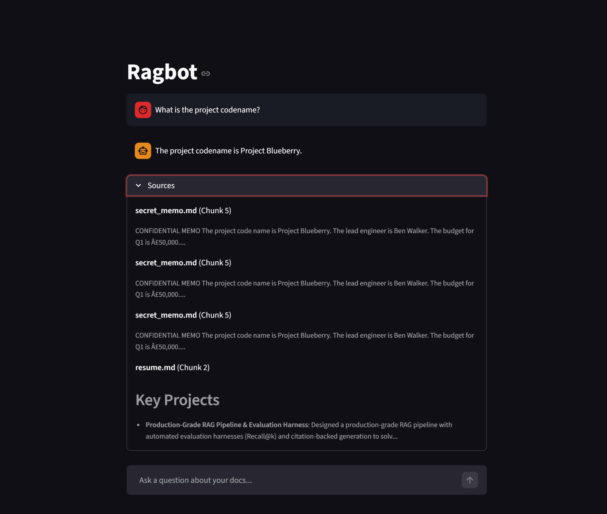
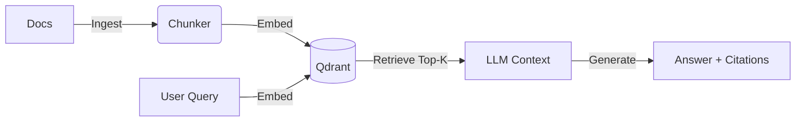

# Portfolio RAG




A production-ready RAG (Retrieval Augmented Generation) pipeline that enables chatting with custom documents. This project demonstrates **clean architecture**, **automated evaluation**, and **reproducible infrastructure** for AI engineering.

## Features

- **End-to-End Pipeline**: Ingestion, chunking, embedding, and retrieval using LangChain LCEL.
- **Vector Database**: Self-hosted **Qdrant** instance running in Docker.
- **Evaluation Harness**: Automated `Recall@k` testing to prove retrieval quality (currently **100%** on benchmark).
- **Citation-Backed Answers**: Chat UI provides source citations (filename + chunk index) for every claim to prevent hallucinations.
- **CI/CD**: GitHub Actions pipeline runs integration tests and evals on every commit.

## Architecture



## Quick Start

### Prerequisites
- Python 3.12+ (managed via `uv` or `pip`)
- Docker (for Qdrant)

### 1. Clone & Install
```bash
git clone https://github.com/benwalkerai/Portfolio_RAG.git
cd Portfolio_RAG
uv sync  # or pip install -r requirements.txt
```

### 2. Configure
Copy the example config and add your API key (OpenAI or Ollama compatible):
```bash
cp .env.example .env
# Edit .env to add OPENAI_API_KEY=...
```

### 3. Run Everything (One Command)
If you are on Windows, use the helper script:
```bash
./run_demo.bat
```
*This will ingest the sample data, run the evaluation suite to verify quality, and launch the Streamlit app.*

If you are on Linux/Mac, use the bash script:
```bash
./run_demo.sh
```

## Evaluation & Testing

Reliability is key. This repo includes:

1.  **Integration Tests** (`tests/test_retrieval.py`):
    Ensures the vector database is reachable and ingestion logic preserves metadata.
    
2.  **Retrieval Evaluation** (`evals/run_eval.py`):
    Runs a test set of questions against the index to calculate **Recall@4**.
    
    *Current Baseline:*
    | Metric | Score |
    |--------|-------|
    | Recall@4 | **100%** |

## Project Structure

```text
├── app.py              # Streamlit Chat UI
├── rag/                # Core RAG Logic
│   ├── ingest.py       # Loader & Chunker
│   └── store.py        # Qdrant Connection Factory
├── evals/              # Evaluation Harness
│   ├── dataset.json    # QA Ground Truth
│   └── run_eval.py     # Recall Calculator
├── tests/              # Pytest Integration Tests
├── data/               # Document Knowledge Base
└── .github/            # CI/CD Workflows
```

## About Me
Built by **Ben Walker**. This project serves as a reference implementation for a clean, testable RAG architecture.
